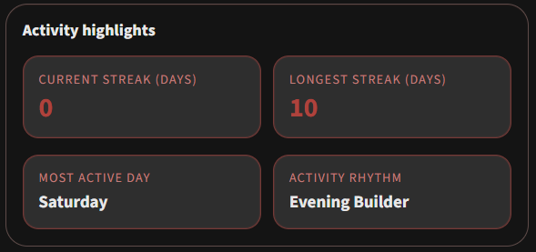
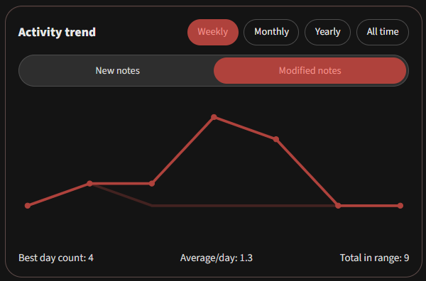
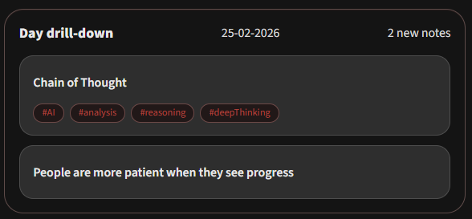

<h1 align="center">Obsidian Vault Activity</h1>

<p align="center">
  <a href="#"></a>
  <a href="#"></a>
  <a href="#"></a>
</p>

Turn your vault into a focused writing analytics lab. Vault Activity tracks streaks, trends, and click-through note lists to answer one useful question:

**"Am I actually revisiting and updating my notes, or just collecting them?"**

Vault Activity is an Obsidian plugin that tracks **new note** and **modified note** activity, then presents it through dashboard widgets built for fast daily check-ins.

## Why this plugin exists

The primary goal is to make note capture and maintenance visible. Vault Activity helps you answer whether you are revisiting and refining ideas over time by surfacing:

- Current and longest streaks tied to real note activity
- Most active weekday and rhythm summary to reveal your editing patterns
- Trend charts across weekly, monthly, yearly, and all-time windows
- Drill-down note lists behind each chart point to see which notes are behind the activity

> [!NOTE]
> If you follow Zettelkasten, it is easy to over-indulge on collecting fleeting notes and under-invest in linking and refining existing ideas. Vault Activity helps you keep both sides in balance so your system keeps compounding.



## Features

### 1) Dashboard widgets at a glance

- Streak stats and activity highlights
- Weekly, monthly, yearly, and all-time trends
- Metric toggle between **New notes** and **Modified notes**



### 2) Drill-down details

- Weekly and monthly: click a day to list matching notes
- Yearly and all-time: click a week or month to inspect grouped notes



### 3) Flexible configuration to suit your vault

- Tune conditions for streaks and summary stats
- Use your note metadata by configuring frontmatter keys for created and modified timestamps
- Set Include and Exclude folder filters to ensure you get the most relevant insights for your workflows

## Usage

### Commands

- `Open Vault Activity`
- `Refresh Vault Activity data`

### Obsidian settings

| Setting                   | What it does                                                  | Default            |
| ------------------------- | ------------------------------------------------------------- | ------------------ |
| Dashboard include folders | Optional allow-list scope for dashboard widgets and note lists | Empty              |
| Dashboard exclude folders | Exclude scope used when include list setting is empty        | `Templates`        |
| Streak calculation mode   | Choose what marks a day active                               | `new-and-modified` |
| Created date property     | Frontmatter (property) key for new-note timestamps                      | `Date`             |
| Modified date property    | Frontmatter (property) key for modified-note timestamps                 | `Last modified`    |
| Auto-refresh              | Recompute on create, modify, delete, and rename events       | `true`             |
| Refresh debounce (ms)     | Delay before recomputing after events                        | `400`              |

## Important behavior notes

> [!IMPORTANT]
> Obsidian provides the current modified time for files, not a full historical timeline of every edit event.
> The dashboard represents each note's latest known activity position, not a complete per-edit history.

## Privacy

Vault Activity is local-first. 🔒

- No external analytics
- No remote data sync by this plugin
- Data is stored in Obsidian plugin storage for local snapshots and settings

## Development

### Scripts

```bash
npm run dev            # watch/dev build
npm run build          # production build
npm run lint           # eslint
npm run test           # vitest
npm run test:coverage  # vitest with coverage
npm run format         # prettier
```

### Tech stack & tools


### 

## Roadmapped improvements

- [ ] Handle wider date format compatibility for frontmatter date fields
- [ ] Improve determination of 'modified' notes.
- [ ] Suggest inactive notes for review, updating or deletion

## Author

Built by **daniegee** with **GitHub Copilot**

If Vault Activity helps your writing cadence, drop a star and keep the streak alive. 📈
